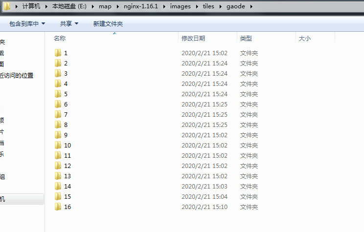

## 使用ngnix部署百度/高德等离线地图瓦片服务器


### 下载地图瓦片
使用全能地图下载器下载地图瓦片


### 配置ngnix

修改ngnix的配置文件

```
worker_processes  1;

events {
    worker_connections  1024;
}

http {
    include       mime.types;
    default_type  application/octet-stream;
    sendfile        on;
    keepalive_timeout  65;

    server {
        listen       8080;
        server_name  localhost;

        location / {
            root   html;
            index  index.html index.htm;
        }
        
         location /tiles/ {
               root "E:/map/nginx-1.16.1/images";
         }
    }
}
```

目录E:/map/nginx-1.16.1/images是存放地图的瓦片，注意下面还有几级目录。




修改nginx默认的首页

```

<!DOCTYPE html>
<html>
    <head>
        <title>Custom Tile Server</title>

        <meta charset="utf-8" />
        <meta name="viewport" content="width=device-width, initial-scale=1.0">

        <link rel="stylesheet" href="https://unpkg.com/leaflet@1.3.1/dist/leaflet.css" integrity="sha512-Rksm5RenBEKSKFjgI3a41vrjkw4EVPlJ3+OiI65vTjIdo9brlAacEuKOiQ5OFh7cOI1bkDwLqdLw3Zg0cRJAAQ==" crossorigin=""/>
        <script src="https://unpkg.com/leaflet@1.3.1/dist/leaflet.js" integrity="sha512-/Nsx9X4HebavoBvEBuyp3I7od5tA0UzAxs+j83KgC8PU0kgB4XiK4Lfe4y4cgBtaRJQEIFCW+oC506aPT2L1zw==" crossorigin=""></script>

        <style>
            html, body, #map {
                width: 100%;
                height: 100%;
                margin: 0;
                padding: 0;
            }
        </style>
    </head>

    <body>
        <div id="map"></div>

        <script>
            var map = L.map('map').setView([0, 0], 3);

            L.tileLayer('tiles/gaode/{z}/{x}/{y}.png', {
                maxZoom: 16,
                attribution: 'Map data &copy; <a href="https://www.openstreetmap.org/">OpenStreetMap</a> contributors, <a href="https://creativecommons.org/licenses/by-sa/2.0/">CC-BY-SA</a>',
                id: 'base'
            }).addTo(map);
        </script>
    </body>
</html>

```

## 验证
打开 http://127.0.0.1:8080

瓦片的地址
http://127.0.0.1:8080/tiles/gaode/{z}/{x}/{y}.png


